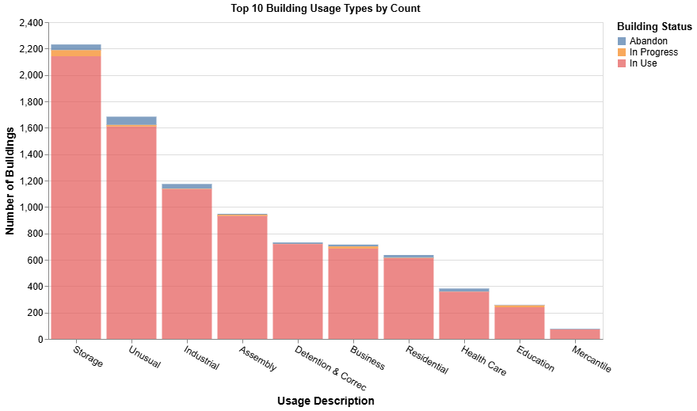
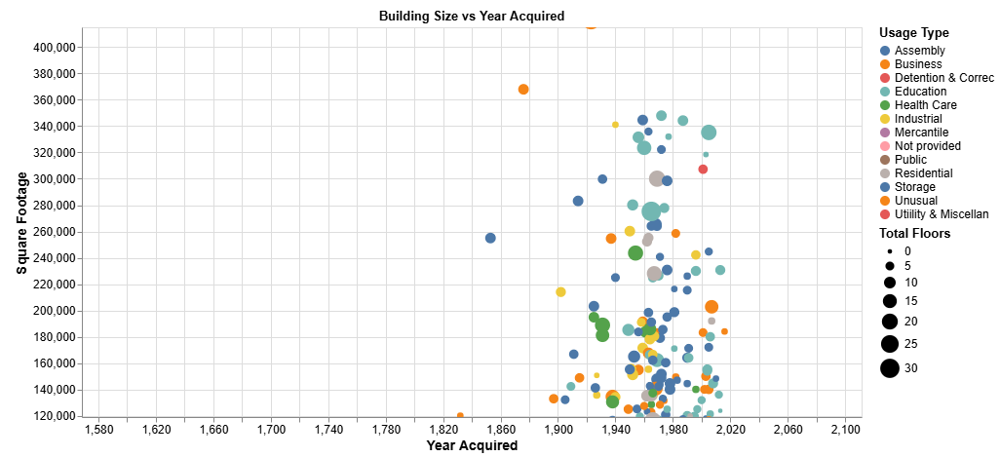

# 📘 Assignment 6: Building Inventory Visualizations

---

## 🔗 Notebook Link  
[Assignment 6 Notebook – Building Inventory Visualizations](https://nbviewer.org/github/jeya17112k/jeya17112k.github.io/blob/main/Assignment6_BuildingInventory_Visualizations.ipynb)

## 🔗 Dataset Link  
[Building Inventory CSV](https://raw.githubusercontent.com/UIUC-iSchool-DataViz/is445_data/main/building_inventory.csv)

---

## 📊 Plot 1 – Top 10 Building Usage Types by Count (Transparent Stacked Bar)

This bar chart visualizes the top 10 building usage categories (`Usage Description`) by count of buildings, with each bar segmented by `Bldg Status`. The x-axis displays the 10 most frequent usage types, and the y-axis shows the number of buildings for each. Within each bar, the building statuses—such as "In Use", "In Progress", and "Abandon"—are stacked vertically. This provides a concise yet multi-dimensional view of how building usage and status intersect. To help highlight all categories within each bar, I applied a slight transparency effect to the bar segments, which prevents top layers from fully obscuring smaller ones beneath.

In terms of design choices, this plot uses nominal encoding for `Usage Description` on the x-axis, and a quantitative encoding for count on the y-axis. I chose stacked bars to allow for the distribution of building statuses within each category, and opted for a transparent fill (`opacity=0.7`) to allow partial visibility of underlying segments. Color was mapped to `Bldg Status` using Altair’s categorical palette, ensuring that each building state has a distinct hue. Axis labels were rotated by 30 degrees to improve readability for long usage names. Tooltips were also enabled to give users detailed information on hover.

On the data preparation side, I began by stripping whitespace from column names to avoid access errors. I then used `value_counts()` in pandas to identify the top 10 usage categories, which I filtered from the dataset using `.isin()`. This was necessary to limit the x-axis and maintain clarity. No aggregation was done manually; I relied on Altair’s `count()` aggregate function to automatically calculate the number of buildings in each group.

This chart was not reused or adapted from Homework 5. While Homework 5 may have used bar charts, this version includes a new dataset, new variables (`Bldg Status` and `Usage Description`), and introduces transparency as a design element to enhance interpretation. It also includes a top-N filter and stacked layout not present in the earlier assignment.

While the x-axis is categorical (which limits Altair’s `.interactive()` support), the chart layout was widened to 700px to allow the full range of categories to be viewed without clutter. Combined with the transparent encoding and tooltips, this makes the visualization engaging and clear even without zooming features.

---

## 📊 Plot 2 – Building Size vs Year Acquired (Interactive)

This plot visualizes how building size, measured by `Square Footage`, varies across the year it was acquired. It uses a scatter plot where the x-axis represents `Year Acquired` and the y-axis represents `Square Footage`. Each point represents a building, and the color of each point encodes its `Usage Description`. This allows us to compare patterns across different usage types and time. To provide even more dimensionality, I encoded `Total Floors` as the size of each point — giving insight into the vertical scale of each building. The chart offers a dynamic way to explore how building size and function have evolved over time.

In terms of encodings, I selected continuous quantitative axes for both X and Y, with a color encoding for `Usage Description:N` to allow categorical comparisons across building types. The point size was mapped to `Total Floors` to emphasize physical scale. I chose this encoding over shape because point size conveys magnitude more intuitively. A circular `mark_circle()` was used for better density management on scatter plots, especially with overlapping points. The color palette was automatically generated but tested for contrast to ensure categories are distinguishable even in dense clusters. Tooltips were enabled for user interactivity and immediate access to metadata such as square footage, floor count, and location name.

Before plotting, I stripped column names of any extra whitespace to ensure accurate referencing, and I verified all fields were appropriately typed (e.g., `Year Acquired` and `Square Footage` as quantitative fields). I used no other major transformations like grouping or aggregation for this chart, because the goal was to maintain granularity and analyze data at the individual building level. However, this lack of transformation was a deliberate design choice to preserve the richness of the raw dataset and allow interaction-driven filtering.

There is no reuse of any plot or analysis logic from Homework 5. This is a completely new scatter-based exploration with a different dataset and set of visual encodings. Homework 5 focused more on bar charts and categorical summaries, whereas this plot provides a continuous, time-based lens into physical infrastructure. None of the code or transformations are reused from previous work, ensuring this submission meets the originality expectation.

This visualization includes enhanced interactivity. Users can zoom and scroll on both axes, which is enabled using `.interactive()` in Altair. Additionally, a legend-based filter allows the user to isolate specific usage types. This is achieved using Altair’s `selection_point()` combined with `add_params()`, enabling multiple categorical filters through the color legend. Unselected data fades to a lower opacity, making the focused category visually pop. This helps reduce visual clutter and allows meaningful exploration within dense regions. Together, these interactivity features make the scatter plot both functional and engaging.
